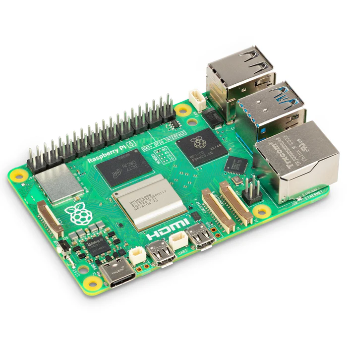
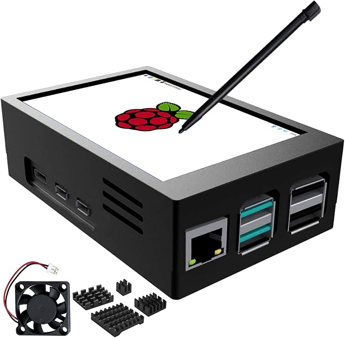
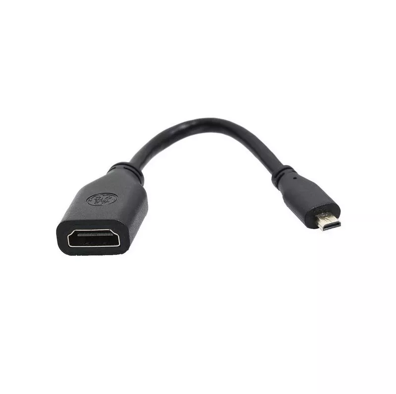
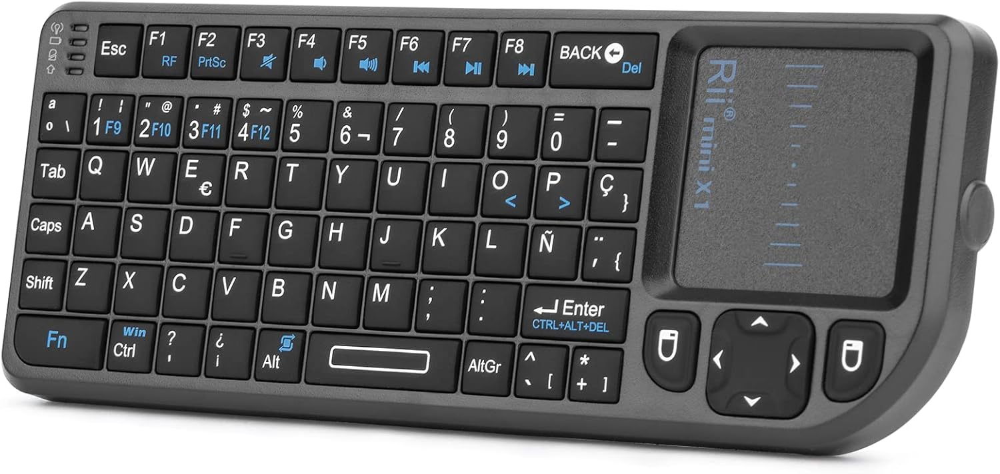
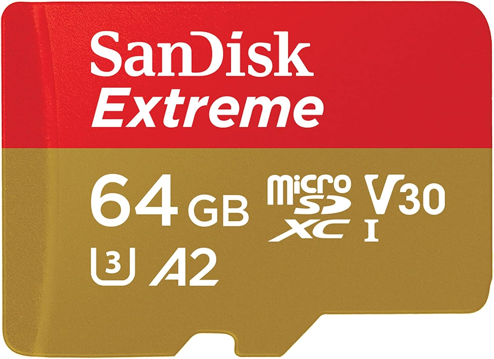

# Componentes

### Placa Raspberry Pi 5

La placa en si. Varia mucho de precio dependiendo del pais, pero en España en Amazon es donde más caro está.
- **Precio de compra:** 110,70 € (en Kubii).
- **Comparativa:** En Amazon, el precio ronda los 135,10 €.

- 📎 [Ver en Kubii](https://www.kubii.com/es/pi-5-gaming-pack/4106-1832-raspberry-pi-5-3272496315938.html#/ram-8_gb)
- 📎 [Ver en Amazon](https://www.amazon.es/Raspberry-Pi-SC1112-5-8GB/dp/B0CK2FCG1K)

>Actualización: en la pagina donde lo compre (Kubii) ha subido 30€ desde que lo compré, por eso conviene mirar en las [tiendas](./02-tiendas.md) oficiales y/o buscar packs de inicio.

### Pantalla y video

#### Pantalla táctil 3.5" LCD + carcasa + ventilador pantalla + disipadores

El producto que escogí tiene ya cierta refrigeración para la caja compatible con la pantalla, ya que buscar una pantalla y una caja que le valga por separado es complicado.

- **Precio:** 23,99 €
- **Experiencia:** Aunque la calidad del panel no es muy buena, está bien para usos con resoluciones pequeñas. Viene con drivers y permite configuraciones como rotación de pantalla o uso como doble monitor (aunque eso no es con los drivers por defecto y hay que hacer las configuraciones en el debian).
- **Precaución:** Al montar el ventilador a la pantalla, no apretar demasiado los tornillos, ya que eso aprieta en panel por atras, se puede despegar y provocar fugas de luz. También hay que tener en cuenta que esta pantalla en la Raspi 5 SOLO es compatible con el Raspberry Pi OS, lo cuál no es malo del todo ya que es el SO recomendado, pero para otros proyectos en otras distros puede ser un impedimento.

- 📎 [Ver en Amazon](https://www.amazon.es/dp/B0D2M75GMB)
- 📎 [Ver en AliExpress](https://es.aliexpress.com/item/1005008133308539.html)
- 📄 [Documentación y Drivers (LCDWiki)](https://www.lcdwiki.com/MHS-3.5inch_RPi_Display)

> Los ventiladores son distintos en cada tienda, pero los drivers de la pantalla son los mismos.

#### Adaptadores de video

Para conectar la Raspi a un monitor externo, utilizo un adaptador simple en lugar de un cable completo, así utilizo un HDMI que ya tengo y no tener que usar un cable completo a microHDMI. Tambien aproveche una capturadora barata de HDMI a USB, permitiéndome con OBS usar la Raspi sin tener que apagar el ordenador o cambiar la entrada del monitor, aunque sin embargo, tiene mucha latencia. En caso de querer ponerlo en un monitor, puede que haga falta tener un adaptador segun los puertos del monitor, ya puede ser HDMI a DisplayPort o a VGA.

- **Adaptador Micro-HDMI a HDMI:** 3,00 € (En Kubii o AliExpress).
- **Capturadora HDMI a USB:** 10 €
- **Nota:** Ya que por ahora no lo tengo para ver video en 4k, puedo permitirme usar adaptadores baratos que cumplan bien su función.

- 📎 [Adaptador económico (Kubii)](https://www.kubii.com/es/cables-adaptadores-de-video/2752-cable-hdmi-a-micro-hdmi-3272496299573.html)
- 📎 [Adaptador económico 2 (Kubii)](https://www.kubii.com/es/cables-adaptadores-de-video/2753-adaptador-hdmi-a-micro-hdmi-8716309072731.html)
- 📎 [Cable completo (Kubii)](https://www.kubii.com/es/cables-adaptadores-de-video/2704-cable-hdmi-a-micro-hdmi-05m-3272496298927.html)
- 📎 [Capturadora](https://www.kubii.com/es/cables-adaptadores-de-video/3430-adaptador-de-hdmi-a-usb-7892021062319.html)

> La capturadora es la más genérica, se puede encontrar por el mismo precio en la tienda Kubii, Amazon... etc. Pero en AliExpress se puede encontrar más barata.

### Periféricos

Para mi uso, he preferido un mini teclado y touchpad 2 en 1 para tenerlo todo con un espacio reducido. Pero se puede usar cualquier teclado y ratón normal o incluso un teclado 2 en 1 más grande.

- **Mini teclado:** 21 €
- **Conexión:** Aunque la Raspberry Pi tiene Bluetooth, prefiero usar este teclado con receptor USB incluido para no tener problemas con drivers y que no se tenga que emparejar, existen otras versiones como está pero con Bluetooth.
- **Batería:** La batería debería de durar bastante, y lo bueno es que es recargable por USB C, aunque en las imágenes de Amazon salga un microUSB.

- 📎 [Mini Teclado (Amazon)](https://www.amazon.es/dp/B00ZEZ4PQG)
- 📎 [Teclado Grande (Amazon)](https://www.amazon.es/Tiardey-inal%C3%A1mbrico-Recargable-computadoras-compatibles/dp/B0D1R2XW2H)

### Fuente de alimentación

He elegido la fuente oficial de 27W USB-C 5V/5A.

- **Motivo:** La Raspberry Pi 5 requiere 5V y 5A. Casi ningún cargador de móvil o portátil ofrece este amperaje específico a 5 voltios. Usar la oficial evita problemas. Además que si buscas cargadores o fuentes genéricas con esas especificaciones, estan todas dirigidas a Raspberry Pi 5.
- **Dato:** Eso es lo malo de esta Raspi, ya que la 4 si se podía usar con menos energía.
- **Color:** En negro por las tiendas oficiales de Raspberry Pi, ya que en Amazon solo esta en blanco.

- 📎 [Fuente Oficial 27W (Kubii)](https://www.kubii.com/es/fuentes-de-alimentacion/4107-1890-fuente-de-alimentacion-raspberry-pi-27w-usb-c-3272496315761.html)

### Almacenamiento

Una tarjeta microSD de una marca reconocida (SanDisk, Samsung) es suficiente. Es importante evitar marcas genéricas para asegurar que los datos no se corrompan o mientan en el tamaño.
- **Idea:** Tener varias tarjetas para tener "distintas" Raspis, cambiando la tarjeta puedes cambiar el uso que quieras. Por ejemplo, una tarjeta para aplicaciones personales, otra para un proyecto concreto, etc.
- **Tamaño y velocidad:** con 64 GB da de sobra, se pueden tener incluso 32 GB y no haria falta mucho más. A no ser que quieras guardar películas, o cosas de mucho tamaño, pues entoces es recomendable una SD más grande o incluso conectar una SSD en el puerto que esta Raspbery Pi tiene.

- 📎 [Micro SD menos rápida](https://www.amazon.es/SanDisk-microSDXC-Chromebook-Adaptador-Transferencia/dp/B0BFG8BPQF)
- 📎 [Micro SD normal](https://www.amazon.es/SanDisk-Extreme-MicroSDXC-UHS-I-Class/dp/B09X7C7LL1?__mk_es_ES=%C3%85M%C3%85%C5%BD%C3%95%C3%91&sr=8-4)
- 📎 [Micro SD más rápida](https://www.amazon.es/SanDisk-microSDXC-Adaptador-Rendimiento-Aplicaciones/dp/B09X7BYSFG?source=ps-sl-shoppingads-lpcontext&language=es_ES)
- 📎 [Ejemplo SSD (Tiendatec)](https://www.tiendatec.es/raspberry-pi/almacenamiento/2394-raspberry-pi-nmve-ssd-m2-2230-256gb-512gb.html)

[⬅ Volver al Índice](../README.md)