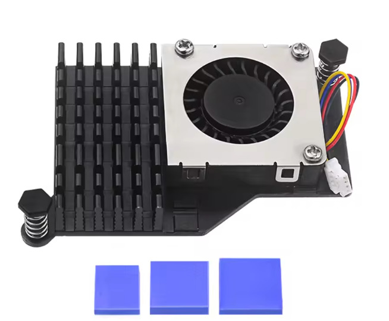
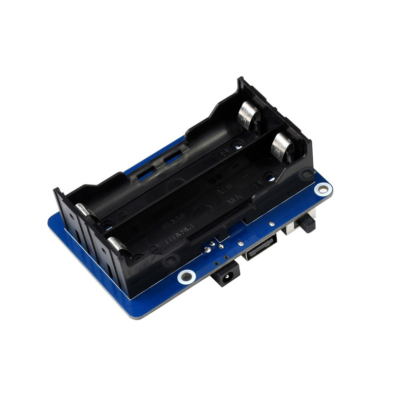
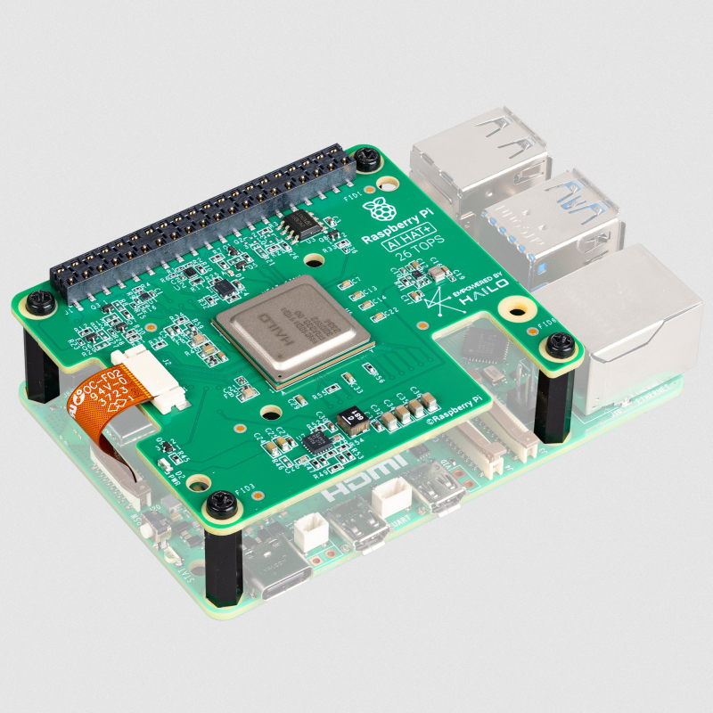

# Componentes extra

Lista de accesorios interesantes que no tengo pero me interesan:

- **Refrigeración:** Disipadores como los oficiales más baratos. 📎 [Ver en AliExpress](https://es.aliexpress.com/item/1005009843237918.html)
    
- **Batería / UPS HAT:** Para convertir la Pi en un dispositivo portátil. Requiere cambiar la carcasa por una mas grande, ya sea básica o impresa en 3D personalizada y comprar las pilas de litio.
    - 📎 [Opción en Amazon](https://www.amazon.es/Geekworm-X1205-Raspberry-Shutdown-Detection/dp/B0F2FKZ2YY)
    - 📎 [Opción en TiendaTec](https://www.tiendatec.es/raspberry-pi/raspberry-pi-alimentacion/2539-hat-ups-sai-para-raspberry-pi-5-5v-5a.html)
    - 📎 [Opción en Amazon de caja](https://www.amazon.es/Geekworm-X1205-C1-Raspberry-Active-Cooler/dp/B0F2HQ61YM)
    
- **Inteligencia Artificial:** El módulo oficial AI HAT para correr modelos locales y usarlo en camaras que detecten lo que ven o en agentes personalizados. 📎 [Ver en TiendaTec](https://www.tiendatec.es/raspberry-pi/ai-raspberry-pi/2398-raspberry-pi-ai-hat-13tops-26tops.html)
    

[⬅ Volver al Índice](../README.md)